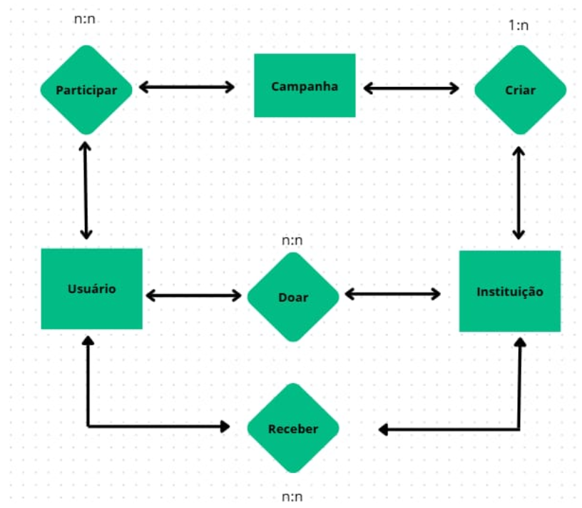
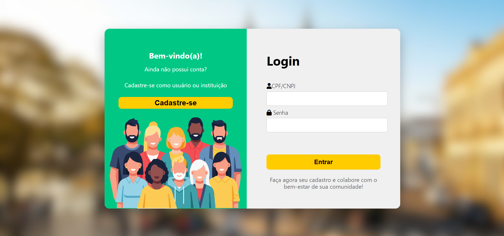
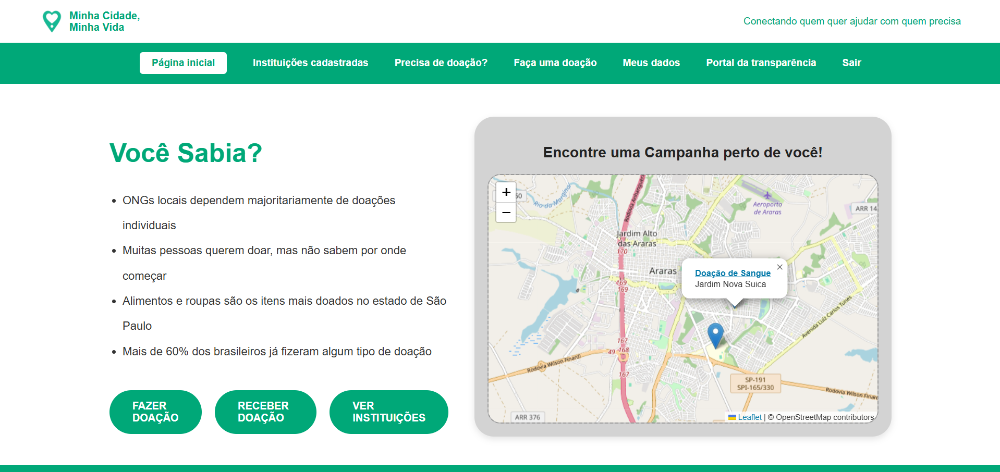
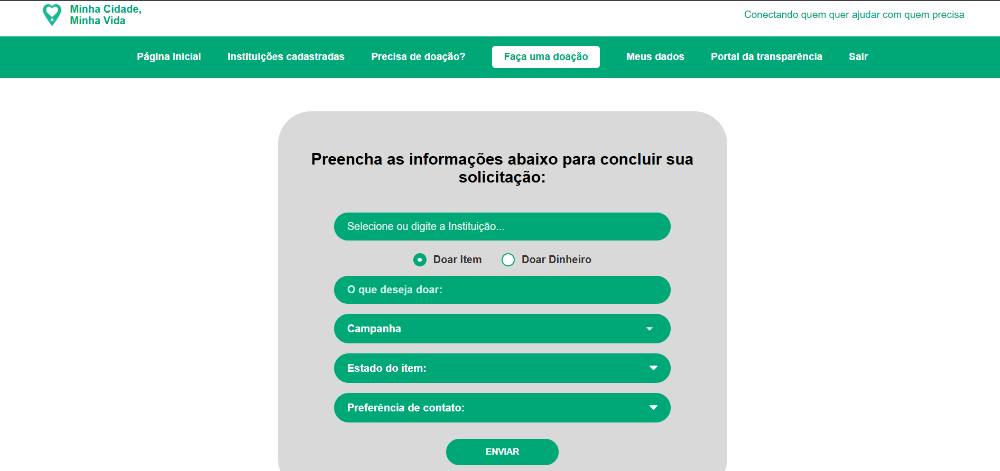
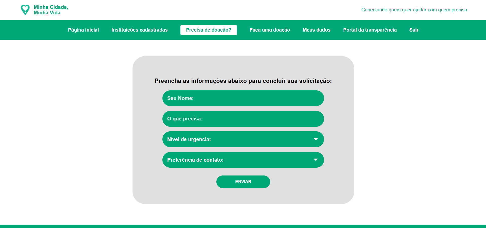
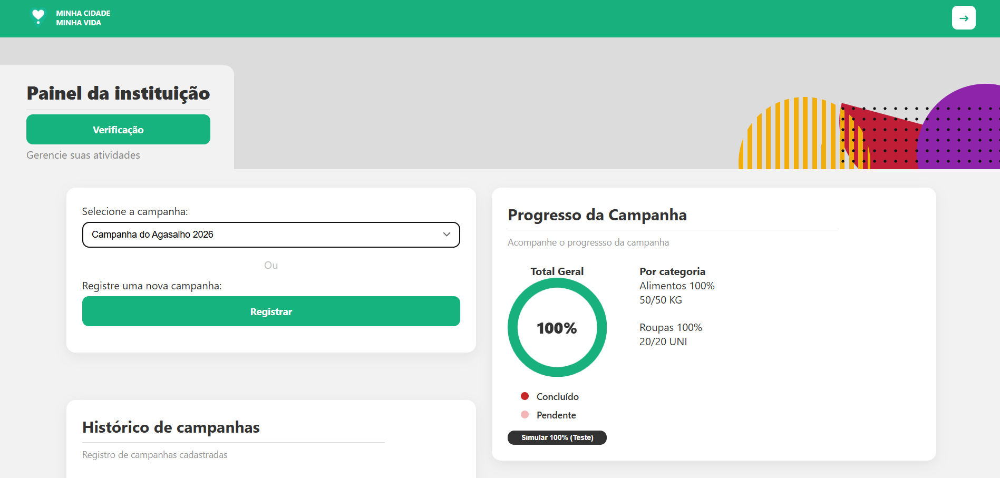

# Minha Cidade, Minha Vida 🌆

## 📝 Sobre o Projeto

O **Minha Cidade, Minha Vida** é um projeto desenvolvido na matéria de Aplicações Integ. em Engenharia da Computação I, do curso de **Engenharia da Computação** da **FHO - Fundação Hermínio Ometto**. 

A plataforma foi idealizada para atuar como um facilitador social, **aproximando a população das instituições de caridade e ONGs da própria cidade**. Através de uma interface intuitiva e integração com mapas, o sistema permite que os cidadãos localizem facilmente entidades assistenciais, conheçam suas necessidades (sejam doações de alimentos, roupas ou apoio financeiro) e saibam como ajudar de forma direta e assertiva.

---

## 🎯 Objetivo

O principal objetivo do projeto é utilizar a tecnologia como ferramenta de transformação social, centralizando e visibilizando as ações de ONGs e instituições de caridade locais. A plataforma visa facilitar o fluxo de doações e o engajamento voluntário da população, conectando quem quer ajudar com quem realmente precisa de apoio na comunidade, aplicando conceitos de arquitetura de software e geolocalização.

---

## 🛠️ Tecnologias Utilizadas

O projeto foi construído utilizando as seguintes tecnologias e frameworks:

* **Backend:** .NET Core / C# (ASP.NET Core MVC / Web API)
* **Frontend:** HTML5, CSS3, JavaScript, Razor Pages
* **Geolocalização:** MapBox API e OpenStreetMap
* **Banco de Dados:** MySQL MariaDb
* **ORM:** Entity Framework Core

---

## 🗄️ Arquitetura do Banco de Dados

O sistema utiliza o banco de dados relacional **MySQL** para gerenciar os fluxos de usuários, campanhas e solicitações de doações. 

Abaixo estão listadas as tabelas que estruturam a aplicação:

* `user_tb`: Gerencia o cadastro de usuários (doadores e/ou representantes de instituições).
* `campanhas_tb`: Armazena as campanhas ativas criadas para arrecadação ou pedidos de auxílio.
* `categorias_campanha_tb`: Classifica as campanhas (ex: Alimentos, Vestuário, Saúde, Voluntariado) para facilitar a busca e filtragem no mapa.
* `solicitacaodoacao`: Registra os pedidos formais de doação emitidos pelas entidades ou usuários.
* `fazerumadoacao`: Controla o histórico e o fluxo das doações efetivamente realizadas pelos usuários através da plataforma.



---

## 📸 Demonstração do Projeto

Aqui estão algumas capturas de tela das principais funcionalidades do sistema:

* Tela de Login




* Cadastro


* Area Usuário

 

* Faça Doação



* Precisa Doação



* Area Instituição



---

## 🚀 Como Executar o Projeto

### Pré-requisitos
Antes de começar, você precisará ter instalado em sua máquina:
* [.NET SDK](https://dotnet.microsoft.com/download)
* [Git](https://git-scm.com)
* [MySQL Server](https://dev.mysql.com/downloads/installer/) (ou ambiente equivalente como XAMPP/WampServer com phpMyAdmin)
* 
### Passo a Passo

1. **Clonar o Repositório:**
```bash
   git clone [https://github.com/Bryan-J-Martini/Minha-Cidade-Minha-Vida.git](https://github.com/Bryan-J-Martini/Minha-Cidade-Minha-Vida.git)
   cd Minha-Cidade-Minha-Vida
```
2. **Configuração do Banco de Dados (appsettings.json):**

	Abra o arquivo appsettings.json localizado na raiz do projeto principal e ajuste a string de conexão (DefaultConnection) apontando para o seu servidor MySQL local:
	```
		{
          "ConnectionStrings": {
            "DefaultConnection": "Server=localhost;Database=projeto bd;Uid=root;Pwd=SUA_SENHA_AQUI;"
          },
          "Logging": {
            "LogLevel": {
              "Default": "Information",
              "Microsoft.AspNetCore": "Warning"
            }
          },
          "AllowedHosts": "*"
        }
	```

3. **Configuração da API do MapBox (LocalizacaoService.cs):**
    Para que a renderização dos mapas e a localização das ONGs funcionem corretamente, insira o seu Token da API do MapBox. Abra o arquivo LocalizacaoService.cs e altere a propriedade do token:
    ```
        // LocalizacaoService.cs
    public class LocalizacaoService : ILocalizacaoService
    {
        // INSIRA SEU TOKEN DO MAPBOX NA VARIÁVEL ABAIXO:
        private readonly string _mapboxToken = "SEU_TOKEN_AQUI_pk.eyJ1Ijoi..."; 

        // Restante do código do serviço...
    }
    ```
---

## 📦 Dependências e Pacotes NuGet

O projeto faz uso das seguintes dependências principais:

* Microsoft.EntityFrameworkCore - ORM para persistência de dados.

* Pomelo.EntityFrameworkCore.MySql - Provedor de dados para integração do EF Core com o MySQL.

* Microsoft.EntityFrameworkCore.Tools - Auxílio em comandos CLI/Migrations.

* Newtonsoft.Json - Serialização e desserialização de dados JSON (integrações de API).

---

## 👥 Integrantes
Este projeto foi desenvolvido pelos alunos do curso de Engenharia da Computação da FHO:
* [Bryan Martini](https://github.com/Bryan-J-Martini)
* [Daniel Remédio](https://github.com/DanRelief)
* [Pedro Mantovani](https://github.com/Vallkari)
* [Thayná Adrielly](https://github.com/Tags2005)

---

## 👨‍🏫 Orientação
* **Professor Orientador:** Prof. Me. Mauricio Acconcia Dias
* **Instituição:** FHO - Fundação Hermínio Ometto
* **Curso:** Engenharia da Computação